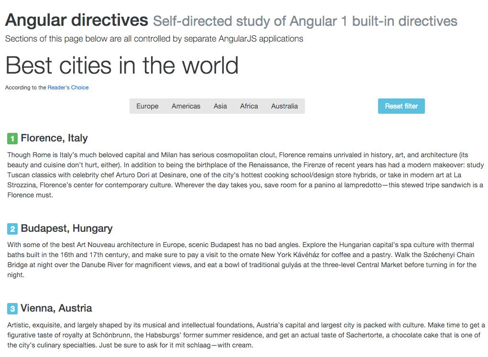

# learn-angular-directives

> Self-directed study of Angular 1 built-in directives, including a homework assignment

[![Build status][solution-ci-image] ][solution-ci-url]

[solution-ci-image]: https://travis-ci.org/bahmutov/learn-angular-directives.png?branch=master
[solution-ci-url]: https://travis-ci.org/bahmutov/learn-angular-directives

## Angular 1 directives

After completing this study you will be able to:

* Understand the value of `ng-repeat`
* Use `ng-if`, `ng-switch` and `ng-class`
* Find the various event directives available such as `ng-focus`
* Use event directives to call methods in a controller

### Installation

While all these examples require just a static page and can be inspected, modified
and shown by open the included `index.html` file.

    git clone git@github.com:bahmutov/learn-angular-directives.git
    cd learn-angular-directives
    npm install
    open index.html

I assume a modern browser with good Developer Tools, like Chrome. The `index.html`
page already includes Angular library from a CDN and Bootstrap4 style. It also
boostraps an application around `<div id="cities">` element.

We are going to start with a pretty simple page, but the important thing to notice
is the mock content and styles. The Angular framework shines when it is applied to
an existing static page, created by a designer. With a few built-in directives we
can bring a page to life!

The page will look something like this



If you inspect the page [index.html](index.html) you will find a LOT of static markup,
something like this

```html
<div class="row">
  <div class="card-group">
    <div class="card card-block">
      <h4 class="card-title"><span class="label label-success">1</span> Florence, Italy</h4>
      <p class="card-text">Though Rome is ...</p>
    </div>
    <div class="card card-block">
      <h4 class="card-title"><span class="label label-info">2</span> Budapest, Hungary</h4>
      <p class="card-text">With some of the ...</p>
    </div>
  </div>
</div>
```

The page shows a list of cities as rated by CNN's Reader's Choice [source][cities-ref].
You might disagree with the ratings, but let us just concentrate on making the page better
using Angular.

[cities-ref]: http://www.cntraveler.com/galleries/2014-10-20/top-25-cities-in-the-world-readers-choice-awards-2014/30

### Sandbox

In addition to the main large "cities" page you are going to make live using Angular,
I provided another static page [demo/index.html](demo/index.html) that shows the little
code snippets from this README file. These snippets are live, to make sure the snippets
actually do what I claim they do, and for you to play around with them.

    open demo/index.html

You should see list of items, a couple of buttons, etc.

### Assignment and testing

Because we are transforming the "Cities" application from static mock up to full application,
each section will have a little assignment where you would transform the `index.html` and
`cities.js` a little. The BDD specs are located inside `test` folder and use Mocha
and AngularJS testing library called [ng-describe](https://github.com/kensho/ng-describe).
You can read the introduction in the blog post
"[1, 2, 3, tested](http://glebbahmutov.com/blog/1-2-3-tested/)". I am using
this helper library on top of [angular-mocks](https://docs.angularjs.org/api/ngMock)
to avoid writing a lot of boilerplate code.

The testing specs are executed using Karma tool against Chrome browser

    npm test

For example, to verify the presence of a list of cities on the scope in `CitiesController`,
there is unit test

```js
// test/cities-spec.js
ngDescribe({
  name: 'CitiesApp controller',
  module: 'CitiesApp',
  controller: 'CitiesController',
  tests: function (deps) {
    it('has list of cities on the scope', function () {
      var scope = deps.CitiesController;
      la(Array.isArray(scope.cities),
        'mising cities', scope.cities);
    });
  }
});
```

At first the test fails, because the scope is empty. It will be up to you to solve little
problems as you read this file to make all unit tests pass.

## Showing list of items using `ng-repeat`

We start making our static page dynamic by removing all the duplicate markup and
replacing it with a single template that will iterate over a list with actual data.
All data (cities, rankings, links) will be in a single Array attached to the `$scope`
object, while the markup will just render it using `ng-repeat` directive.

First, read the information about the `ng-repeat` at the official AngularJS website.
[Here][ng-repeat] is a direct link, but I usually just Google the `ng-repeat directive`
sentence to find it. Notice that there are [other directives][directives] described
in the docs, if you click the navigation links.

The documentation is pretty long, but all we care is iterating over a plain list of
objects. Let us say we have a list of strings and want to put them into `<li>`
elements. The application's controller code is simple

```js
function StringsController($scope) {
  $scope.strings = ['foo', 'bar', 'baz'];
}
```

and the markup uses `ng-repeat` directive on the element we want to *repeat*
for each item in the list. In this case it would be `<li>` element

```html
<ul ng-controller="StringsController">
  <li ng-repeat="s in strings">{{ s }}</li>
</ul>
```

That is it! When the application starts, the Angular framework will create 3 `<li>` elements,
each with its own item (referred by variable `s` in this case, but any name would do).
The we use a template expression to simply show the string inside the `<li>` element.

What happens if somehow we add a new element to the array `$scope.strings`? Well, Angular
will run its digest cycle and will create one more element `<li>`, will put the new string
into the template there and will add it to the document object model (DOM). Thus it will
become something like this.

```html
<ul ng-controller="StringsController">
  <!-- ng-repeat: s in strings -->
  <li>foo</li>
  <li>bar</li>
  <li>baz</li>
  <li>some new string</li>
</ul>
```

Pretty cool.

### Objects in the list

The list can have anything inside, including objects. We just need to use dot notation
to access nested properties. For example, in the list anove, let us also show the length
of each string.

```html
<li ng-repeat="s in strings">{{ s }} has {{ s.length }} characters</li>
```

Or if you want real objects, let make a list of messages, attach it to the scope
instead of strings

```js
$scope.messages = [{
  message: 'hi',
  from: 'Friendly person'
}, {
  message: 'bye',
  from: 'Mister X'
}];
```

and then print them inside a template.

```html
<ul ng-controller="ObjectsController">
  <li ng-repeat="m in messages">
    message <strong>{{ $index + 1}}</strong>
    - {{ m.from }} says "{{ m.message }}"
  </li>
</ul>
```

Notice how we used a special variable `$index` available inside the `ng-repeat` directive.
It is a zero-based index of the current item in the list, just like inside an iterator callback
when iterating over an Array in javascript

```js
['foo', 'bar'].forEach(function (s, index) {
  console.log(s, 'at', index);
});
/* prints
"foo" at 0
"bar" at 1
*/
```

[ng-repeat]: https://docs.angularjs.org/api/ng/directive/ngRepeat
[directives]: https://docs.angularjs.org/api/ng/directive

### Exercise - use ng-repeat to show cities

* Instead of static content listing the cities in the `index.html` page,
  move all content to the list of objects on the scope inside `CitiesController`.
* Replace separate city DOM elements with single `ng-repeat` use.
* Make sure all unit tests in [test/cities-spec.js](test/cities-spec.js) pass
  inside the block `CitiesApp controller - ng-repeat` suite.
* Quick tip: you can just test a particular suite by setting its property `only` to true.

## Changing appearance using ng-class directive

As you implemented the solution to the previous section using `ng-repeat`
you have probably noticed a small problem. In the starting page the first
city (with rating 1) had the label with class `label label-success`.

```html
<span class="label label-success">1</span>
```

Every other city has class `label label-info`. When you wrote `ng-repeat`
element, which one did you pick? How can we vary the class attributes based
on the object data?

Turns out, we can do this using another built-in directive `ng-class`.
Read the documentation, since it has some quirks, but in general we use it in
addition to regular "static" class attribute on an element.

For example, if we wanted to set success label class if a string is "foo"
and danger if a string is "bar" we can do the following

```html
<li ng-repeat="s in strings">
  <span class="label label-default"
    ng-class="{ 'label-success': s === 'foo', 'label-danger': s === 'bar' }">{{ s }}</span>
</li>
```

As you can see, each class name will be toggled on if the corresponding expression
is true. If the expression is false, the class will be removed from the element's class list.

### Alternative

Inline `ng-class` expressions really encode an object

```
{
  classNameA: expression A,
  classNameB: expression B
}
```

The expressions can include any constants and scope properties. As you can see,
the inline syntax quickly can become very cumbersome. I usually prefer an alternative
syntax by returning a class object from a scope method.

First, attach a method to the scope to return the same class name object

```js
controller('StringsController', function ($scope) {
  $scope.strings = ['foo', 'bar', 'baz', 'longer string'];
  $scope.getClasses = function (s) {
    return {
      'label-success': s === 'foo',
      'label-danger': s === 'bar'
    };
  };
})
```

Then call the method in the `ng-class` value, don't forget to pass the item itself.

```html
<li ng-repeat="s in strings">
  <span class="label label-default"
    ng-class="getClasses(s)">{{ s }}</span>
</li>
```

Same effect, but much cleaner template, and the scope methods are easily testable.

### Exercise - use ng-class to style the rating label

* The first city should have the green `label-success` class, while
  the rest should have `label-info` class.
* Compute the classes by attaching method to the `CitiesController` scope
* The method should take a city object with `rating` property and return
  the appropriate class when rating is 1 or not.
* There are unit tests in the `CitiesApp controller - ng-class` pass.

## Showing and hiding elements using ng-if, ng-show and ng-hide

Let us display a big large message for a winning city. The data controlling the
display is clear - it is the same `city.rating === 1` condition as in the previous
assignment. But now we need to completely hide the element if the rating is not 1
and show it if the rating is 1. How do we do this?

Let us say we want to display an element depending on a data on the scope.
It is very simple - just use `ng-if="expression"` code. For example to show
messages for strings with length 3 we could do something like this

```html
<ul ng-controller="StringsController">
  <li ng-repeat="s in strings">{{ s }} has {{ s.length }} characters
    <strong ng-if="s.length === 3">A triple!</strong></li>
</ul>
```

There is another directive with similar function - `ng-show`. Try using
it instead of `ng-if` in the `demo/index.html` example. Notice that when using
`ng-if` there is NO element in the DOM. It is completely removed, including any data
bindings or event listeners. But if you use `ng-show` the element is present, and
updated, it is just set to be invisible. You can use `ng-hide` to do the opposite -
display the element by default, and only hide if the expression is true.

In general, if the data is only computed once, use `ng-if`. If the data is dynamic
and can change, use `ng-show`. In our example, the winning city is determine from
the data only once; it will never change, thus using `ng-if` is a preferred method.

### Exercise - use ng-if to display "A winner" text

* Add an element to the city element that will show "A winner" text if the city
  has rating 1.


To show how we can use `ng-show`, let us add a couple of buttons to filter cities
based on the continent. At first we are going to have plain static markdown with
all continents selected.

```html
<div class="col-xl-6 col-xl-offset-3">
  <div class="btn-group" role="group" aria-label="Continent filter">
    <button type="button"
      class="btn btn-secondary active">Europe</button>
    <button type="button"
      class="btn btn-secondary active">Americas</button>
    <button type="button"
      class="btn btn-secondary active">Asia</button>
    <button type="button"
      class="btn btn-secondary active">Africa</button>
    <button type="button"
      class="btn btn-secondary active">Australia</button>
  </div>
</div>
<div class="col-xl-3">
  <button type="button" class="btn btn-info">Reset filter</button>
</div>
```

We want to add dynamic behavior to this filtering widget.

### Exercise - implement the continent filtering widget

* Add an object to the scope with properties that will determine if cities on that continent
  should be shown.
* Add `ng-show` directive to the "Reset filter" button. It should be shown only
  if any of the properties inside the `continents` object is false.
  Make the expression a call to a scope function `hidingAContinent()`.
  Test it manually by setting the `continents.europe` to false.
* Make sure your solution has enough data on the scope to pass the unit tests
  inside the 'CitiesApp controller - continents' suite.

## Reacting to the user events, like mouse clicks


## Extra reading

* [Just Enough Angular for Designers](http://onehungrymind.com/just-enough-angular-for-designers/)

### Small print

Author: Gleb Bahmutov &copy; 2015

* [@bahmutov](https://twitter.com/bahmutov)
* [glebbahmutov.com](http://glebbahmutov.com)
* [blog](http://glebbahmutov.com/blog/)

License: MIT - do anything with the code, but don't blame me if it does not work.

Spread the word: tweet, star on github, etc.

Support: if you find any problems with this module, email / tweet /
[open issue](https://github.com/bahmutov/learn-angular-directives/issues) on Github

## MIT License

Copyright (c) 2015 Gleb Bahmutov

Permission is hereby granted, free of charge, to any person
obtaining a copy of this software and associated documentation
files (the "Software"), to deal in the Software without
restriction, including without limitation the rights to use,
copy, modify, merge, publish, distribute, sublicense, and/or sell
copies of the Software, and to permit persons to whom the
Software is furnished to do so, subject to the following
conditions:

The above copyright notice and this permission notice shall be
included in all copies or substantial portions of the Software.

THE SOFTWARE IS PROVIDED "AS IS", WITHOUT WARRANTY OF ANY KIND,
EXPRESS OR IMPLIED, INCLUDING BUT NOT LIMITED TO THE WARRANTIES
OF MERCHANTABILITY, FITNESS FOR A PARTICULAR PURPOSE AND
NONINFRINGEMENT. IN NO EVENT SHALL THE AUTHORS OR COPYRIGHT
HOLDERS BE LIABLE FOR ANY CLAIM, DAMAGES OR OTHER LIABILITY,
WHETHER IN AN ACTION OF CONTRACT, TORT OR OTHERWISE, ARISING
FROM, OUT OF OR IN CONNECTION WITH THE SOFTWARE OR THE USE OR
OTHER DEALINGS IN THE SOFTWARE.
